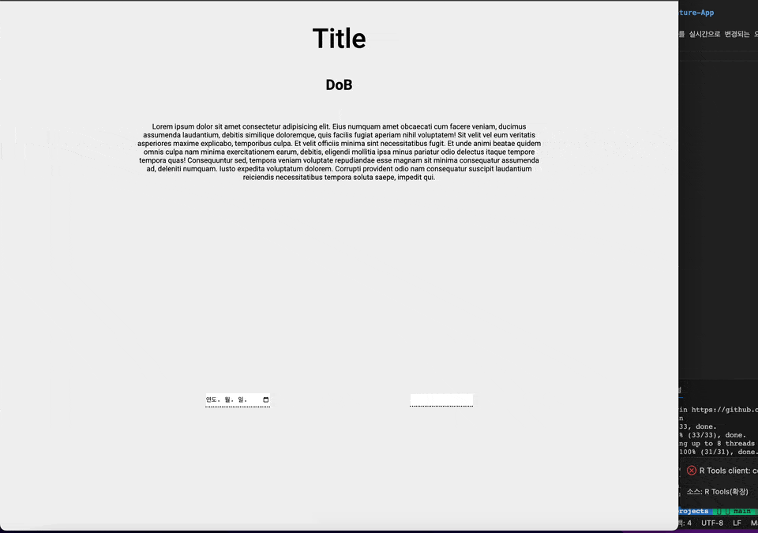
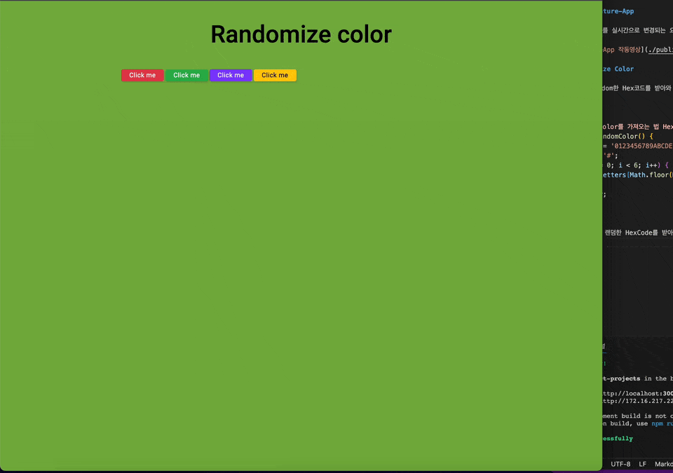

# React Mini Projects

### 1. E-signature-App

input값의 value를 실시간으로 변경되는 요소를 받아와 화면에 출려해주는 미니 프로젝트 입니다.


### 2. Randomize Color

버튼을 누르면 Random한 Hex코드를 받아와 화면에 해당하는 색상을 출력해주는 미니 프로젝트입니다.

```js
// Random하게 Color를 가져오는 법 Hex 코드는 숫자 6개
function getRandomColor() {
  let letters = '0123456789ABCDEF';
  let color = '#';
  for (let i = 0; i < 6; i++) {
    color += letters[Math.floor(Math.random() * 16)];
  }
  return color;
}
```

위와 같은 방식으로 랜덤한 HexCode를 받아와 스타일링해줍니다.

